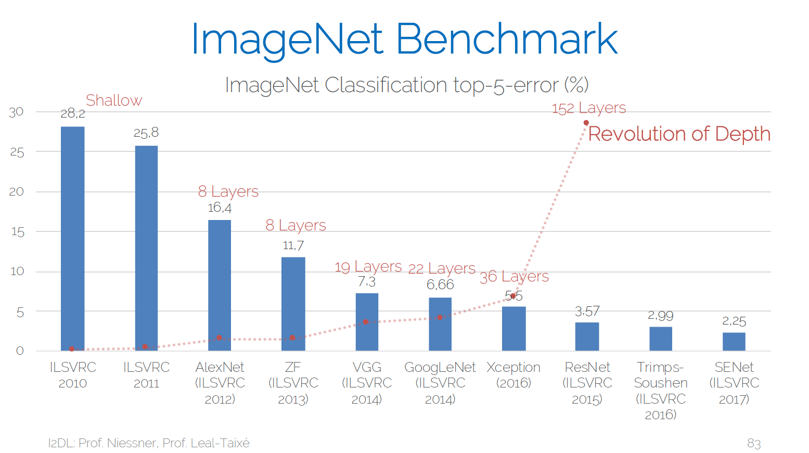

# Image classification with PyTorch

## Environment Setup
1. Install Miniconda\
`curl -O https://repo.anaconda.com/miniconda/Miniconda3-latest-Linux-x86_64.sh`\
`bash Miniconda3-latest-Linux-x86_64.sh`

2. Setup Conda environment\
`conda create -n dlcv python`\
`conda activate dlcv`

3. Install PyTorch Stable (1.10)\
`conda install pytorch torchvision torchaudio -c pytorch`

## Resources

ImageNet competition overview (taken from I2DL lecture series: https://niessner.github.io/I2DL/)

 \
Source: Lecture 10 from I2DL lecture series

### VGG-Net

Paper: https://arxiv.org/abs/1409.1556 \
Youtube implementation tutorial: https://www.youtube.com/watch?v=ACmuBbuXn20&list=PLhhyoLH6IjfxeoooqP9rhU3HJIAVAJ3Vz&index=17

### GoogLeNet

Original Paper: https://arxiv.org/abs/1409.4842 \
Inception-V3 Follow-Up: https://arxiv.org/abs/1512.00567 \
Youtube implementation tutorial: https://www.youtube.com/watch?v=uQc4Fs7yx5I&list=PLhhyoLH6IjfxeoooqP9rhU3HJIAVAJ3Vz&index=18

### ResNet

Paper: https://arxiv.org/abs/1512.03385 \
Youtube implementation tutorial: https://www.youtube.com/watch?v=DkNIBBBvcPs&list=PLhhyoLH6IjfxeoooqP9rhU3HJIAVAJ3Vz&index=19

### DenseNet

Paper: https://arxiv.org/abs/1608.06993 \
Youtube implementation tutorial: https://www.youtube.com/watch?v=ELEqNwv9vkE&list=PLdlPlO1QhMiAkedeu0aJixfkknLRxk1nA&index=10